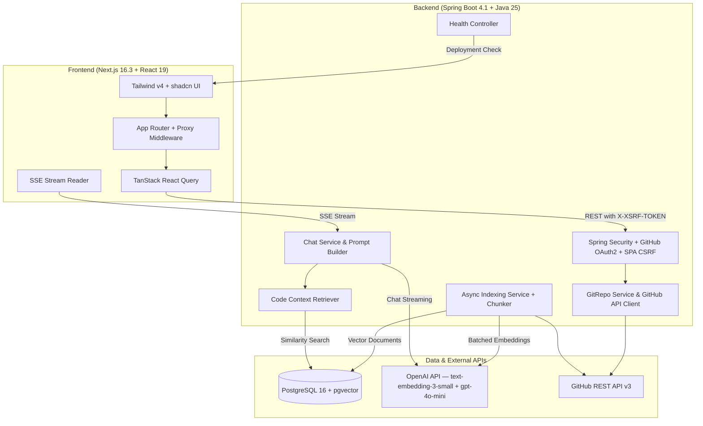

# GitBot — AI-Powered Codebase Assistant

GitBot is a portfolio full-stack application that indexes GitHub repositories and provides real-time, context-aware AI chat over codebases using Retrieval-Augmented Generation (RAG).

---

## Architecture Overview



### Key Technical Pillars
* **Backend**: Spring Boot 4.1.1, Java 25, Spring Data JPA, Spring AI 2.0.0.
* **Frontend**: Next.js 16.3.2 (Turbopack, Next.js 16 `proxy.ts` request proxy layer), React 19, Tailwind CSS v4, shadcn/ui.
* **Database & Vector Store**: PostgreSQL 16 with `pgvector` extension (HNSW index, cosine distance).
* **Security**: GitHub OAuth2 with server-side HTTP-only sessions (`GITBOT_SESSION`), token encryption for stored GitHub PATs, and SPA CSRF protection with `XSRF-TOKEN` cookie/header pair.
* **Streaming Chat**: Server-Sent Events (SSE) via `SseEmitter` streaming OpenAI `gpt-4o-mini` tokens to the Next.js client.

---

## Local Setup & Quickstart

### 1. Prerequisites
* **Java 25** (e.g. Eclipse Temurin 25)
* **Node.js 20+** and npm
* **Docker & Docker Compose**

### 2. Configure Environment Variables
Copy `.env.example` to `backend/.env`:
```bash
cp .env.example backend/.env
```
Populate the required secrets:
* `OPENAI_API_KEY`: Your OpenAI API key for embeddings and completions.
* `GITHUB_CLIENT_ID` & `GITHUB_CLIENT_SECRET`: From your [GitHub OAuth Application](https://github.com/settings/developers).
  * Callback URL: `http://localhost:8080/login/oauth2/code/github`
* `TOKEN_ENCRYPTOR_PASSWORD` & `TOKEN_ENCRYPTOR_SALT`: Custom encryption keys for securing GitHub access tokens in PostgreSQL.

### 3. Start PostgreSQL + pgvector
Start the database container using Docker Compose:
```bash
docker compose up -d
```
Verify the container is healthy:
```bash
docker compose ps
```
The database will be exposed on port `5433` (configurable via `POSTGRES_PORT`).

### 4. Run the Backend
From the repository root or `backend` folder:
```bash
cd backend
./mvnw spring-boot:run
```
The backend starts on `http://localhost:8080`.
Verify health check:
```bash
curl http://localhost:8080/api/health
# {"status":"UP"}
```

### 5. Run the Frontend
From the `client` folder:
```bash
cd client
npm install
npm run dev
```
Open `http://localhost:3000` in your browser.

---

## Security Architecture

1. **Session & Cookie Security**:
   - Authentication sets an `HttpOnly`, `SameSite=Lax` cookie (`GITBOT_SESSION`).
2. **SPA CSRF Protection**:
   - Spring Security uses `CookieCsrfTokenRepository` with `SpaCsrfTokenRequestHandler` and `CsrfCookieFilter`.
   - The frontend reads the `XSRF-TOKEN` cookie (or queries `/api/auth/csrf`) and attaches the token in the `X-XSRF-TOKEN` header on all mutation requests (`POST`, `PUT`, `DELETE`, `PATCH`).
3. **Repository & Vector Isolation**:
   - All repository metadata and chat sessions enforce `userId` ownership checks.
   - Vector similarity queries strictly filter by the authenticated user's indexed `repositoryId`.
4. **Token Encryption**:
   - User GitHub OAuth access tokens are encrypted using AES before persistence in PostgreSQL and decrypted only when syncing repositories or reading files.

---

## Deployment Notes

* **Containerized Backend**: Multi-stage `Dockerfile` is provided at the project root for building an optimized, lightweight Java 25 runtime image.
* **Health Check**: Deployment platforms (Oracle Cloud Infrastructure, Render, Fly.io, Railway) can probe `GET /api/health` for liveness and readiness.
* **Frontend**: Next.js 16 is deployable to Vercel or as a container. Ensure `NEXT_PUBLIC_API_BASE_URL` points to the public backend domain and configure `FRONTEND_URL` / `CORS_ALLOWED_ORIGINS` in the backend.

---

## Production Roadmap & Future Enhancements
* **Extended Multi-Branch Context**: Deep cross-branch comparison and semantic merge conflict analysis.
* **Granular Database Migrations**: Transition from Hibernate `ddl-auto: update` to formal Flyway versioned migrations for team-based schema evolution.
* **Custom Model Providers**: Optional support for alternative local/cloud LLM providers via Spring AI abstraction.
