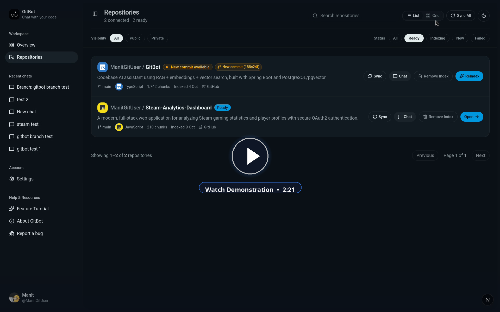
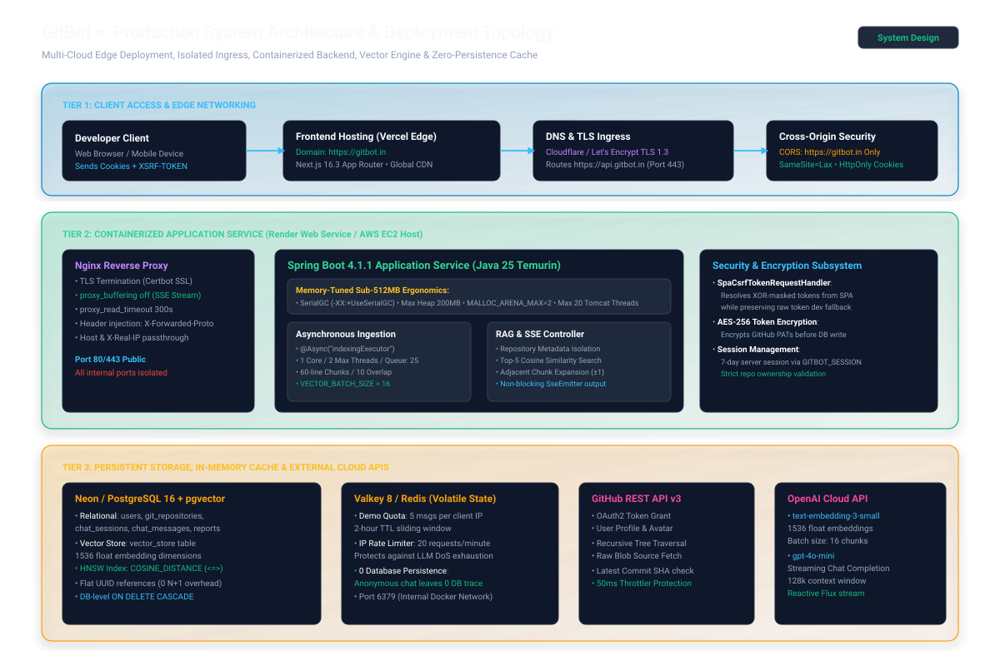
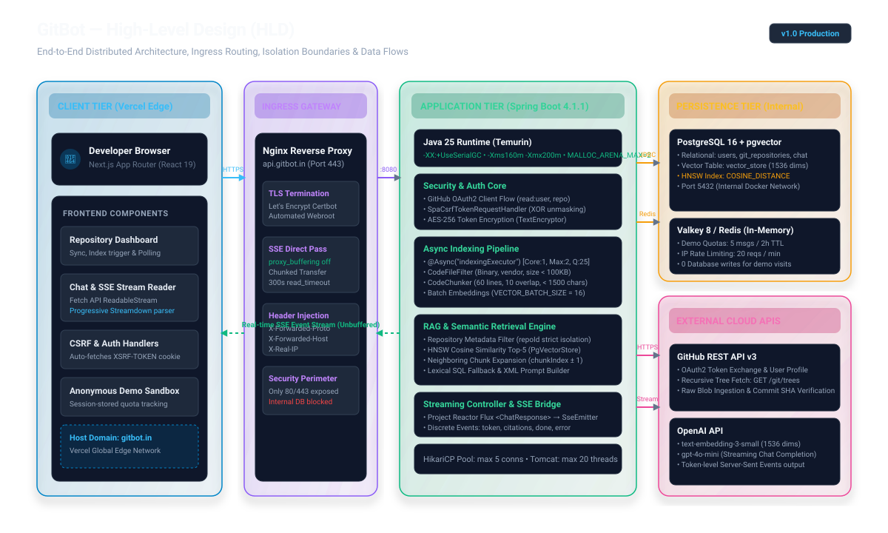
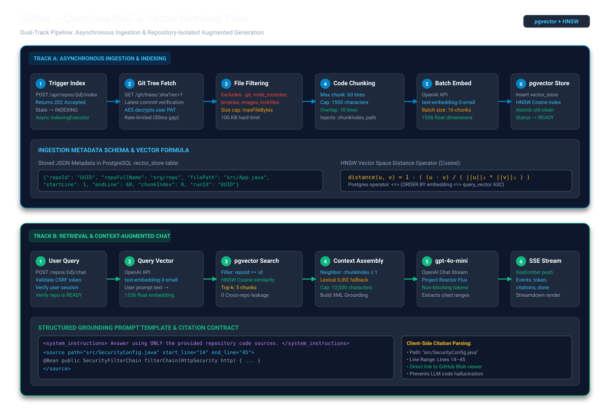
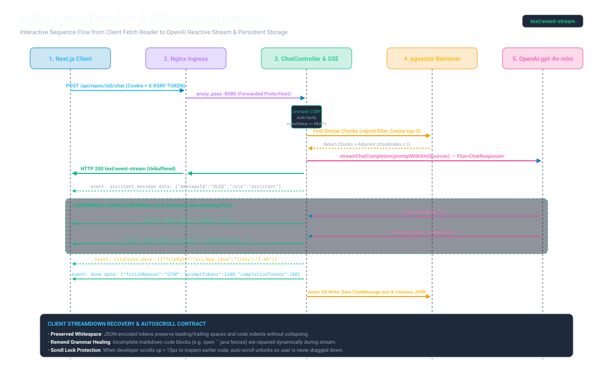
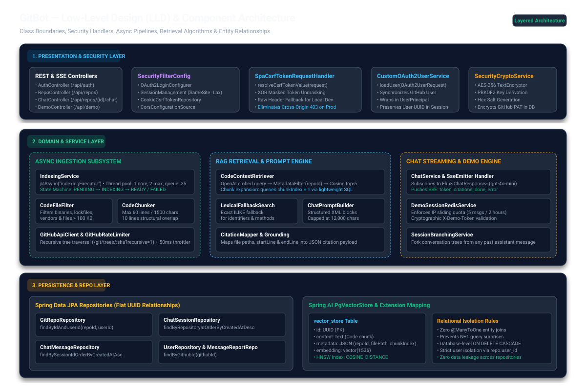

# GitBot — AI-Powered Codebase Assistant

GitBot is a full-stack, retrieval-augmented codebase assistant built with Spring Boot 4.1.1, Java 25, Next.js 16, and PostgreSQL 16 with pgvector. It connects to GitHub via OAuth2, synchronizes and indexes repositories into vector embeddings, and provides repository-isolated, citation-backed AI conversations streamed in real time over Server-Sent Events (SSE).

<p align="center">
  <sub>
    🌐 <strong>Live App:</strong> <a href="https://gitbot.in">gitbot.in</a> &nbsp;•&nbsp;
    🎥 <strong>Video Walkthrough:</strong> <a href="https://drive.google.com/file/d/1ak5TM7CrnWsm-iVqQy-aKD6-wxf3EWm1/view?usp=sharing">Watch Demonstration</a> &nbsp;•&nbsp;
    📄 <strong>License:</strong> <a href="LICENSE.md">MIT</a>
  </sub>
</p>

<a id="demo"></a>
<div align="center">
  <sub>🎥 <strong>Product Demonstration Walkthrough</strong> (Full features &amp; live codebase conversation)</sub>
  <br/><br/>
  <a href="https://drive.google.com/file/d/1ak5TM7CrnWsm-iVqQy-aKD6-wxf3EWm1/view?usp=sharing">
    
  </a>
  <br/>
  <sub>▶️ <em>Click the preview above to watch the full walkthrough demonstration video (2 min 21 sec)</em> &nbsp;•&nbsp; <a href="https://drive.google.com/file/d/1ak5TM7CrnWsm-iVqQy-aKD6-wxf3EWm1/view?usp=sharing">Open Video on Google Drive ↗</a></sub>
</div>

---

## Overview

Software engineers spend a substantial portion of their time reading, tracing, and onboarding onto complex codebases. GitBot addresses this challenge by turning any GitHub repository into an interactive, conversational knowledge base:

* **The Problem**: Developers need fast, reliable answers to architectural questions, data flows, and code patterns without copying entire files into generic LLM chats or risking hallucinations caused by out-of-context prompts.
* **The Solution**: GitBot clones repository trees on demand, parses and chunks indexable source files, generates 1536-dimensional vector embeddings, and stores them in PostgreSQL with pgvector. When a question is asked, it performs repository-scoped vector similarity search, gathers adjacent code context, and streams citations alongside answers.
* **Target Audience**: Developers onboarding onto new repositories, engineering teams navigating microservices, and recruiters reviewing production-grade full-stack systems engineering.
* **Core Engineering Philosophy**: Maintain architectural simplicity. Avoid operational overhead from standalone vector databases by utilizing PostgreSQL with `pgvector`, enforce strict data boundaries across repositories, and deliver real-time streaming using lightweight Server-Sent Events.

---

## Key Features

* **GitHub OAuth2 Authentication**: Secure user onboarding requesting `read:user` and `repo` scopes, with user tokens AES-encrypted before persistence.
* **Repository Discovery & Synchronization**: Auto-discovers public and private repositories, tracking `latestCommitSha` against `indexedCommitSha` to detect stale indexes.
* **Asynchronous Indexing Pipeline**: Background ingestion with recursive Git tree traversal, file type and size filtering, structural code chunking, and batch embedding generation.
* **Code Chunking & Embeddings**: Content-aware code chunking with overlapping lines, mapped to 1536-dimensional embeddings via OpenAI `text-embedding-3-small`.
* **Repository-Isolated Semantic Search**: Vector similarity search strictly constrained by `repositoryId` metadata filter, preventing cross-codebase data leakage.
* **Neighboring Chunk & Lexical Fallback**: Automatically pulls adjacent chunks for continuous code context and falls back to SQL keyword search when semantic matches are sparse.
* **Streaming AI Conversations**: Real-time token streaming powered by OpenAI `gpt-4o-mini` delivered via Server-Sent Events (`SseEmitter`), with code citations referencing file paths and line ranges.
* **Chat Session Management**: Multi-session persistence with conversation branching from specific messages, title generation, and public share links.
* **Interactive Demo Mode**: Zero-authentication sandbox exploring GitBot's own codebase, enforced by Redis IP rate limiting and quota tracking without database writes.
* **Production Deployment Architecture**: Deployed across Vercel (`gitbot.in`), Render (`api.gitbot.in`), and serverless Neon PostgreSQL, hardened with cross-origin CSRF resolution and memory-tuned JVM container ergonomics.

---

## System Architecture



GitBot is designed with a clean separation of concerns between user-facing presentation, backend domain orchestration, persistent storage, and external AI/VCS platforms:

### Runtime Flow
1. **Client Interaction**: The user accesses the Next.js application on `gitbot.in` and initiates actions (OAuth sign-in, repo synchronization, chat prompts).
2. **Backend Processing**: The Spring Boot backend on `api.gitbot.in` authenticates requests via HTTP-only session cookies and CSRF tokens, orchestrating business logic across dedicated services.
3. **External Services**:
   * **GitHub REST API**: Discovers user repositories and fetches raw source tree files.
   * **PostgreSQL with pgvector**: Stores relational entities (`users`, `git_repositories`, `chat_sessions`, `chat_messages`) and vector embeddings in `vector_store`.
   * **Valkey / Redis**: Manages demo IP rate limits and temporary message quotas.
   * **OpenAI API**: Computes vector embeddings (`text-embedding-3-small`) and streams chat completions (`gpt-4o-mini`).
4. **Streaming Response**: Generated tokens and code citations stream back to the Next.js client via Server-Sent Events (SSE).

### High-Level Design (HLD)



---

## RAG & Vector Retrieval Pipeline



### Ingestion & Indexing Pipeline
$$\text{GitHub Repository} \xrightarrow{\text{Tree API}} \text{Source Files} \xrightarrow{\text{Filter and Chunker}} \text{Code Chunks} \xrightarrow{\text{Batch Embeddings}} \text{pgvector Storage}$$

1. **Discovery & Validation**: Verifies repository ownership and resolves the latest commit SHA via GitHub API.
2. **File Filtering (`CodeFileFilter`)**: Recursively inspects Git tree items, excluding binaries, images, package lockfiles, minified bundles, vendor folders (`node_modules`, `target`, `.git`), and files exceeding `100 KB` (`maxFileBytes: 102400`).
3. **Code Chunking (`CodeChunker`)**: Partitions source files into structural text segments using a sliding window:
   * **Max Chunk Size**: 60 lines (capped at 1,500 characters).
   * **Overlap**: 10 lines, preserving structural continuity between adjacent segments.
   * **Metadata Enrichment**: Injects `repoId`, `repoFullName`, `filePath`, `startLine`, `endLine`, `chunkIndex`, and ingestion `runId` into every document.
4. **Batched Embeddings**: Chunks are grouped into batches of 16 (`VECTOR_BATCH_SIZE = 16`) and dispatched to OpenAI `text-embedding-3-small`, transforming text into 1536-dimensional float vectors.
5. **Persistence**: Writes document text, embeddings, and JSON metadata into the `vector_store` table.
6. **Atomic Clean-up**: Old vectors from previous runs are removed only after the new index run completes successfully.

### Retrieval & Context Assembly (`CodeContextRetriever`)
$$\text{User Query} \xrightarrow{\text{Embed}} \text{Query Vector} \xrightarrow{\text{Repository Filter}} \text{Cosine Search} \xrightarrow{\text{Context Assembly}} \text{LLM} \xrightarrow{\text{SSE}} \text{Browser}$$

1. **Query Embedding**: The incoming user query is embedded into a 1536-dimensional vector using `text-embedding-3-small`.
2. **Repository-Scoped Search**: Executes similarity search against `vector_store` with an exact metadata filter: `repoId == :repositoryId`.
3. **Neighboring Chunks**: For top-ranking matches, the retriever queries adjacent chunks (`chunkIndex ± 1`) via lightweight SQL, supplying broader file context without generating additional vector embeddings.
4. **Lexical Fallback**: If vector search yields 0 matches for a query containing identifier tokens (e.g., method names), the system executes an exact SQL `ILIKE` fallback scoped to the repository.
5. **Budget & Ranking**: Constrains context to a maximum of 5 top chunks (`top-k: 5`) and a total ceiling of 12,000 characters (`max-context-chars: 12000`).
6. **Structured Prompt Construction**: Chunks are assembled into structured XML tags (`<source path="..." lines="...">...</source>`) within the system prompt, providing ground-truth references for citations.

---

## Real-Time Chat & Streaming Lifecycle



Chat responses are streamed incrementally using HTTP Server-Sent Events (SSE):

* **Backend Dispatch**: `ChatController` and `DemoController` produce `text/event-stream` via Spring's `SseEmitter`.
* **Reactive Model Bridge**: Subscribes to OpenAI's streaming API via Project Reactor `Flux<ChatResponse>`, pushing SSE events as tokens arrive from `gpt-4o-mini`.
* **Structured Event Types**:
  * `assistant_message`: Emits placeholder assistant metadata.
  * `token`: Emits individual generated text tokens.
  * `citations`: Emits source file references and line numbers.
  * `done`: Signals clean stream completion and flushes persistence.
  * `error`: Transmits structured error payloads on generation failures.
* **Frontend Rendering**: The Next.js client reads the stream via the Fetch API `ReadableStream` reader, passing chunks into `streamdown` to preserve markdown syntax, code fences, and whitespace dynamically.
* **Scroll Lock Protection**: When a developer scrolls up > 15px to read earlier code, auto-scroll unlocks so the user is never dragged down by streaming tokens.

---

## Low-Level Design & Component Architecture



The backend is developed with **Spring Boot 4.1.1** running on **Java 25**, structured into clean layered boundaries:

```
com.example.gitbot
├── config/              # Security, CORS, Async, and Web infrastructure configuration
├── controller/          # REST & SSE endpoints (Auth, Repo, Chat, Demo, PublicShare, Health)
├── dto/                 # Request/response records, projections, and timing metrics
├── entity/              # JPA entity definitions mapping relational schema
├── enums/               # Domain enumerations (IndexStatus, MessageRole, MessageStatus, etc.)
├── exception/           # Global exception hierarchy and RFC 7807 error responses
├── repository/          # Spring Data JPA repositories with custom query derivations
├── security/            # OAuth2 handlers, UserPrincipal, CSRF resolvers, and filters
└── service/             # Core business domain logic
    ├── ai/              # Retrieval, prompt assembly, citation mapping, and SSE handlers
    ├── demo/            # Anonymous demo rate limiting and Redis session state
    ├── github/          # GitHub API integration client and rate limit handling
    └── indexing/        # File filtering, chunking strategies, and async execution
```

### Architectural Highlights
* **Security & Sessions**: Stateless JWTs were avoided in favor of secure, server-side HTTP sessions (`GITBOT_SESSION`) with `SameSite=Lax` and `HttpOnly` flags, reducing XSS token exfiltration attack surfaces.
* **CSRF Protection**: Implements `CookieCsrfTokenRepository` paired with a specialized `SpaCsrfTokenRequestHandler` that handles both raw and XOR-masked CSRF tokens across distributed frontend/backend domains.
* **Decoupled Relational Entities**: Relational models use flat UUID identifiers (e.g., `userId`, `repositoryId`) rather than JPA `@ManyToOne` object references. This prevents cascading query overhead and N+1 fetch surprises while delegating referential integrity directly to database foreign-key constraints.
* **Asynchronous Indexing**: The `@Async("indexingExecutor")` thread pool isolates CPU- and I/O-intensive repository ingestion from the web request threads, returning immediate `202 Accepted` responses.

---

## Data Model

Relational schema managed in PostgreSQL 16 with relational foreign-key integrity constraints (`ON DELETE CASCADE` / `ON DELETE SET NULL`):

| Table | Primary Key | Key Columns | Purpose |
| :--- | :--- | :--- | :--- |
| **`users`** | `id` (UUID) | `github_id`, `github_username`, `display_name`, `avatar_url`, `access_token` *(AES encrypted)*, `token_scopes` | Authenticated user accounts and credentials |
| **`git_repositories`** | `id` (UUID) | `user_id` *(FK)*, `github_repo_id`, `full_name`, `is_private`, `is_demo`, `index_status`, `chunk_count`, `latest_commit_sha`, `indexed_commit_sha` | Synchronized user repositories and indexing status |
| **`chat_sessions`** | `id` (UUID) | `user_id` *(FK)*, `repository_id` *(FK)*, `parent_session_id` *(self-ref FK)*, `branch_message_id`, `title`, `is_shared`, `share_token` | Chat conversations and branching threads |
| **`chat_messages`** | `id` (UUID) | `session_id` *(FK)*, `role`, `content`, `status`, `citations` *(JSON text)* | User prompts, assistant answers, and file citations |
| **`message_reports`** | `id` (UUID) | `user_id` *(FK)*, `session_id` *(FK)*, `message_id` *(FK)*, `reason`, `details` | User-reported message feedback |
| **`vector_store`** | `id` (UUID) | `content` *(text)*, `metadata` *(JSONB/JSON)*, `embedding` *(vector(1536))* | pgvector embedding table indexed with HNSW cosine distance |

---

## Redis Usage

Redis (or Valkey) is used as an in-memory, volatile data store:

* **Demo Message Quota (`demo:quota:{sanitizedIp}`)**: Enforces a strict limit of **5 free messages per client IP** within a **2-hour window** (`TTL: 7200s`).
* **Demo Rate Limiter (`demo:rate:{sanitizedIp}`)**: Enforces a rolling window of **20 requests per minute** (`TTL: 60s`) to prevent denial-of-service abuse against LLM endpoints.
* **Demo Session Verification (`demo:session:{sessionId}`)**: Stores the current message count for active anonymous sessions, cryptographically verified on the client via HMAC tokens (`X-Demo-Token`).
* **Zero Database Impact**: Anonymous demo activity is tracked purely in Redis, guaranteeing zero database writes to PostgreSQL from unauthenticated traffic.

---

## Frontend Architecture

The frontend is built with **Next.js 16.3.2** and **React 19**:

* **Rendering & Navigation**: Next.js App Router utilizing `proxy.ts` middleware for client-side route protection across `/dashboard` and `/chat`.
* **Component System**: Styled using Tailwind CSS v4, `@base-ui/react`, and `shadcn/ui`.
* **State Management**: TanStack React Query v5 manages cached server state, indexing status polling (`3000ms`), and optimistic UI mutations.
* **Experience Views**:
  * **Dashboard**: Repository grid with filter/search, sync indicators, and one-click indexing.
  * **Chat Workspace**: Split-view conversational interface with citation preview, branch history, and message retry.
  * **Demo Sandbox**: Instant, registration-free experience anchored to GitBot's codebase.

---

## Production Deployment & Memory Ergonomics

GitBot is engineered to operate reliably under strict container resource constraints:

* **Frontend**: Hosted on **Vercel** with custom domain [`https://gitbot.in`](https://gitbot.in).
* **Backend**: Containerized Spring Boot 4.1.1 on **Render / AWS EC2** with custom domain [`https://api.gitbot.in`](https://api.gitbot.in).
  * **Sub-512MB Memory Tuning**:
    - **Garbage Collector**: SerialGC (`-XX:+UseSerialGC`) eliminating ~70 MB of G1GC native Remembered Set and Card Table overhead.
    - **Native Glibc Memory**: `ENV MALLOC_ARENA_MAX=2` eliminating native malloc arena fragmentation.
    - **Heap & Non-Heap Bounds**: `-Xms160m -Xmx200m -XX:MaxMetaspaceSize=96m -XX:ReservedCodeCacheSize=32m -Xss384k -XX:+ExitOnOutOfMemoryError`.
    - **Thread & Pool Limits**: Tomcat worker threads capped at 20 (`server.tomcat.threads.max: 20`), HikariCP connection pool capped at 5 (`maximum-pool-size: 5`).
    - **Vector Batch Size**: `VECTOR_BATCH_SIZE = 16` chunks to halve transient JSON payload allocations.
    - **Worst-Case RSS**: ~393 MB, maintaining a safe buffer below 512 MB.
* **Relational & Vector Database**: **PostgreSQL 16** with `pgvector` (HNSW cosine distance index).
* **In-Memory Cache**: **Valkey 8 / Redis** for ephemeral rate limiting and quotas.
* **AI Providers**: **OpenAI API** (`text-embedding-3-small` and `gpt-4o-mini`).

---

## Local Development

### Prerequisites
* **Java 25** (Eclipse Temurin 25 recommended)
* **Node.js 20+** and **npm**
* **Docker & Docker Compose**

### 1. Clone & Set Up Local Infrastructure
```bash
git clone https://github.com/ManitGitUser/GitBot.git
cd GitBot

# Start local PostgreSQL 16 (with pgvector) and Valkey Redis
docker compose up -d
```

### 2. Configure Backend Environment
Copy the example environment configuration into `backend/.env`:
```bash
cp .env.example backend/.env
```
Fill in the required local configuration parameters:
```env
DB_URL=jdbc:postgresql://localhost:5433/gitbot
DB_USERNAME=postgres
DB_PASSWORD=3003
REDIS_URL=redis://localhost:6379

OPENAI_API_KEY=your_openai_api_key_here
GITHUB_CLIENT_ID=your_github_oauth_client_id
GITHUB_CLIENT_SECRET=your_github_oauth_client_secret

TOKEN_ENCRYPTOR_PASSWORD=local-dev-encryptor-password
TOKEN_ENCRYPTOR_SALT=local-dev-salt-hex

FRONTEND_URL=http://localhost:3000
CORS_ALLOWED_ORIGINS=http://localhost:3000
SESSION_COOKIE_SECURE=false
```

### 3. Start Backend
```bash
cd backend
./mvnw clean spring-boot:run
```
Verify the backend starts on `http://localhost:8080`:
```bash
curl http://localhost:8080/api/health
# {"status":"UP"}
```

### 4. Start Frontend
In a new terminal window:
```bash
cd client
npm install
npm run dev
```
Open `http://localhost:3000` in your browser.

---

## Environment Variables

| Variable | Required In | Description | Example / Placeholder |
| :--- | :--- | :--- | :--- |
| `DB_URL` | Backend | PostgreSQL JDBC connection URL | `jdbc:postgresql://host:5432/gitbot` |
| `DB_USERNAME` | Backend | Database username | `gitbot_user` |
| `DB_PASSWORD` | Backend | Database password | `your_secret_password` |
| `REDIS_URL` | Backend | Redis or Valkey connection URL | `redis://localhost:6379` |
| `OPENAI_API_KEY` | Backend | OpenAI API key for embeddings and completions | `sk-proj-...` |
| `GITHUB_CLIENT_ID` | Backend | GitHub OAuth application client ID | `your_client_id` |
| `GITHUB_CLIENT_SECRET` | Backend | GitHub OAuth application client secret | `your_client_secret` |
| `TOKEN_ENCRYPTOR_PASSWORD` | Backend | Passphrase used for AES token encryption | `strong_passphrase` |
| `TOKEN_ENCRYPTOR_SALT` | Backend | Hex salt string used for AES token encryption | `hex_salt_value` |
| `FRONTEND_URL` | Backend | Root URL of frontend client for OAuth redirects | `https://gitbot.in` |
| `CORS_ALLOWED_ORIGINS` | Backend | Allowed origins for CORS filter | `https://gitbot.in` |
| `SESSION_COOKIE_SECURE` | Backend | Flag marking session cookie as HTTPS-only | `true` *(prod)* / `false` *(dev)* |
| `SESSION_COOKIE_SAMESITE` | Backend | SameSite policy for session cookie | `lax` |
| `NEXT_PUBLIC_API_BASE_URL` | Frontend | Public base URL of backend API | `https://api.gitbot.in` |

---

## Testing & Quality Assurance

The project is backed by a verified test suite covering unit logic, integration flows, controller web layers, and security policies:

* **Backend Test Suite (`./mvnw test`)**:
  * **175 tests passing** (0 failures, 0 errors, 0 skipped).
  * Covers OAuth token encryption, repository synchronization, code chunking, RAG context retrieval, streaming SSE emitters, demo rate limiting, and CSRF request handling.
* **Frontend Test Suite (`npm run test`)**:
  * **25 tests passing** (0 failures, 0 errors).
  * Covers streaming markdown assembly, token parsing, account deletion dialogs, API error handling, session expiration recovery, and demo storage contracts.
* **Frontend Static Verification**:
  * **ESLint**: Passed with 0 errors and 0 warnings.
  * **Production Build (`next build`)**: 11/11 routes compiled and optimized cleanly under Turbopack.

---

## Engineering Decisions & Architecture Trade-offs

* **Spring Boot 4.1.1 & Java 25**: Java 25 provides modern language ergonomics (records, pattern matching) and long-term stability. Spring Boot provides robust abstractions for Spring Security, OAuth2 authorization code flows, HikariCP connection pooling, and typed Spring AI integration.
* **PostgreSQL 16 + pgvector vs. Standalone Vector DB**: Co-locating relational application entities (`users`, `repositories`, `sessions`, `messages`) and high-dimensional vector embeddings in PostgreSQL maintains full ACID consistency, eliminates dual-write drift, supports native SQL metadata filtering, and requires zero external vector SaaS cost.
* **Redis for Volatile State Only**: Redis is reserved strictly for operations requiring atomic, sub-millisecond sliding windows (demo IP quotas and rate limiting). Authenticated user sessions are stored via HTTP-only server sessions, avoiding unnecessary Redis dependencies for core authentication.
* **Server-Sent Events (SSE) vs. WebSockets**: LLM chat streaming is inherently unidirectional (server $\rightarrow$ client stream). SSE runs over standard HTTP/1.1 and HTTP/2, traverses corporate proxies and firewalls without custom protocol upgrade handshakes, and provides native browser reconnection.
* **Asynchronous Indexing via Isolated Thread Pool**: Repository tree traversal, file filtering, chunking, and embedding require multi-step external network I/O. Decoupling ingestion onto an isolated `@Async("indexingExecutor")` thread pool prevents servlet thread starvation and returns immediate `202 Accepted` responses.
* **Sub-512MB Container Ergonomics**: Tuning the container with SerialGC (`-XX:+UseSerialGC`), glibc arena limits (`MALLOC_ARENA_MAX=2`), a 200MB max heap, and constrained thread pools prevents cgroup Out-Of-Memory termination on low-memory cloud instances.

---

## Known Limitations & Planned Enhancements

* **Synchronous N+1 Commit Verification during Sync**: The current `syncAllRepos` implementation checks remote commit SHAs sequentially via the GitHub API. Future iterations can parallelize requests or offload to background queues.
* **Single-Node In-Memory Async Executor**: The indexing pipeline runs on a local Spring `@Async` executor thread pool. At enterprise scale, this transitions to a distributed message queue (RabbitMQ / Kafka) with dedicated worker nodes.
* **Webhook-Driven Index Invalidation**: Currently, users trigger synchronization manually. Adding GitHub App webhooks will enable automated re-indexing upon git push events.
* **Tree-Sitter Multi-Language AST Chunking**: The current line-based sliding window is deterministic and language-agnostic. Future iterations can integrate Tree-sitter parsers to split along grammatical function and class boundaries.

---

## Project Structure

```
GitBot/
├── backend/
│   ├── src/
│   │   ├── main/
│   │   │   ├── java/com/example/gitbot/
│   │   │   │   ├── config/              # SecurityConfig, CorsConfig, AsyncConfig
│   │   │   │   ├── controller/          # REST & SSE controller layer
│   │   │   │   ├── dto/                 # Request/response DTOs and projections
│   │   │   │   ├── entity/              # JPA entity models
│   │   │   │   ├── repository/          # Spring Data JPA repositories
│   │   │   │   ├── security/            # OAuth2 & CSRF handlers
│   │   │   │   └── service/             # Domain logic (ai, indexing, demo, github)
│   │   │   └── resources/
│   │   │       ├── application.yaml     # Application configuration
│   │   │       └── application-test.yaml# Isolated integration test profile
│   │   └── test/                        # 175 unit and integration tests
│   ├── pom.xml                          # Maven build configuration
│   └── mvnw                             # Maven wrapper
├── client/
│   ├── app/                             # Next.js App Router (dashboard, chat, demo, auth)
│   ├── components/                      # UI components (chat, dashboard, ui)
│   ├── hooks/                           # Custom React Query hooks
│   ├── lib/                             # API clients and streaming readers
│   ├── package.json                     # Frontend dependencies and scripts
│   └── proxy.ts                         # Edge route middleware
├── docker/
│   └── postgres/                        # Postgres extensions and relational migrations
├── docs/
│   ├── demo-thumbnail.png               # Demonstration video preview poster card
│   ├── gitbot-demonstration.mp4         # Demonstration video
│   ├── gitbot-hld.svg                   # High-Level Design architecture
│   ├── gitbot-lld.svg                   # Low-Level Design component architecture
│   ├── gitbot-rag-flow.svg              # Complete RAG pipeline flow
│   ├── gitbot-chat-flow.svg             # Real-time chat & SSE streaming lifecycle
│   └── gitbot-system-architecture.svg   # System design & deployment topology
├── docker-compose.yaml                  # Local development infrastructure
├── Dockerfile                           # Production container image definition
└── README.md                            # Project documentation
```

---

## License

This project is licensed under the MIT License — see the [LICENSE.md](LICENSE.md) file for details.
